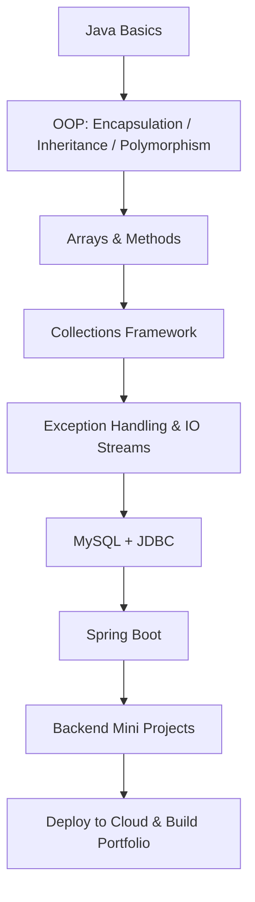

🌟 Java Learning Journey — From Zero to Backend Engineer

     

🚀 About This Repository

This repo records my daily Java learning journey, including:

🔹 Core Java Syntax

🔹 OOP (Encapsulation, Inheritance, Polymorphism)

🔹 Methods, Arrays, Exception Handling

🔹 Mini Projects

🔹 LeetCode Practice

🔹 Gradual Progress Toward Spring Boot & Backend Development

我的目标是 365 天坚持写代码，积累扎实的后端基础，为未来的就业与技术路线做准备。

📊 Learning Stats

🔥 Current Streak: Day 13 / 365

📦 Total Commits: 20

⏳ Total Learning Time: 15h

🧭 Current Stage: Methods & Arrays

🛠 Tech Route: Java → MySQL → Spring Boot → Backend Projects

🗓 Progress Log

每一天都要有真实进步。

| Day | Date | Topic | Status | Notes |  
|------|---------|---------------------------------------------|--------|-------|  
| Day1 | 11/27 | OOP Basics | ✔ | Classes & Objects |  
| Day2 | 11/28 | Lesson 53 Notes | ✔ | Committed notes |  
| Day3 | 11/29 | Encapsulation | ✔ | Getter/Setter |  
| Day4 | 12/01 | LeetCode - FizzBuzz (LC412) | ✔ | Created LeetCode/ folder |  
| Day5 | 12/02 | Operators Review | ✔ | Logical / Relational / Ternary |  
| Day6 | 12/03 | switch Statement | ✔ | Basic + Arrow Syntax |  
| Day7 | 12/04 | Mini Project — Healthy BMI | ✔ | HeimaHealthy.java initial version |  
| Day8 | 12/05 | 重构 BMI（黑马01） | ✔ | Improved structure |  
| Day9 | 12/06 | LeetCode - Roman to Integer (LC013) | ✔ | Solved independently |  
| Day10 | 12/07 | 封装优化 BMI | ✔ | Extracted methods |  
| Day11 | 12/08 | 输入封装 + switch 优化 | ✔ | readValue 方法 |  
| Day12 | 12/09 | 方法声明与调用 + 数组基础 | ✔ | return vs void、数组初始化三种写法 |  
| Day13 | 12/10 | 数组遍历（while）+ 可变参数 | ✔ | while 遍历数组、字符串拼接成 [1,2,3]、varargs 本质为数组 |  

🧩 Featured Mini Projects  
🥗 1. Healthy BMI Calculator

初步实现 ➜ 重构 ➜ 封装优化  
一个完整的控制台应用，包含：

输入验证

BMI 计算

身体类型判断

目标设定

BMR / TDEE 计算

营养配比建议

📂 code/basics/HeimaHealthy.java

🔢 2. Max of Three Numbers

简单但重要的基础练习。  
📂 code/basics/TheBiggestNumber.java

🧮 3. Roman to Integer — LeetCode LC013

第一道“看得懂 + 自己写对”的 LeetCode 算法题。  
📂 LeetCode/LC013_RomanToInteger.java

🎯 Roadmap (2024–2026)

📌 Next Steps

 完成 OOP 三大特性

 深入数组 + 方法练习

 异常处理初学

 集合框架（List、Map）

 Mini Project #2：迷你记账系统

 Spring Boot 入门（2026 Q2）

❤️ Why This Matters

每天一点点 commit，
都是未来的 技能、作品、简历、竞争力。

👩‍💻 Author

Wenjian Liu — becoming a backend developer, one step a day.
持续更新中，欢迎一起成长 💛
