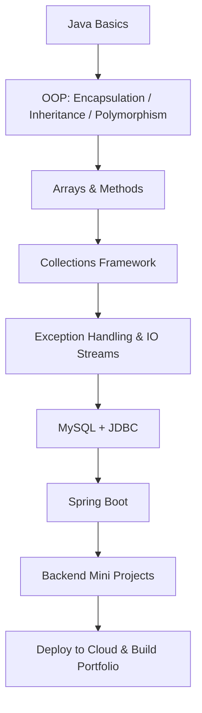

🌟 Java Learning Journey — From Zero to Backend Engineer

     

🚀 About This Repository

This repo records my daily Java learning journey, including:

🔹 Core Java Syntax

🔹 OOP (Encapsulation, Inheritance, Polymorphism)

🔹 Methods, Arrays, Exception Handling

🔹 Mini Projects

🔹 LeetCode Practice

🔹 Gradual Progress Toward Spring Boot & Backend Development

我的目标是 365 天坚持写代码，积累扎实的后端基础，为未来的就业与技术路线做准备。

📊 Learning Stats

🔥 Current Streak: Day 39/ 365

📦 Total Commits: 52 (approx.)

⏳ Total Learning Time: ~32.5h

🧭 Current Stage: Collections Framework + Console CRUD Mini Projects (Consolidation Phase)

🛠 Tech Route: Core Java → MySQL/JDBC → Spring Boot → Backend Projects

🗓 Progress Log

每一天都要有真实进步。

| Day | Date | Topic | Status | Notes |  
|------|---------|---------------------------------------------|--------|-------|  
| Day1 | 11/27 | OOP Basics | ✔ | Classes & Objects |  
| Day2 | 11/28 | Lesson 53 Notes | ✔ | Committed notes |  
| Day3 | 11/29 | Encapsulation | ✔ | Getter/Setter |  
| Day4 | 12/01 | LeetCode - FizzBuzz (LC412) | ✔ | Created LeetCode/ folder |  
| Day5 | 12/02 | Operators Review | ✔ | Logical / Relational / Ternary |  
| Day6 | 12/03 | switch Statement | ✔ | Basic + Arrow Syntax |  
| Day7 | 12/04 | Mini Project — Healthy BMI | ✔ | HeimaHealthy.java initial version |  
| Day8 | 12/05 | 重构 BMI（黑马01） | ✔ | Improved structure |  
| Day9 | 12/06 | LeetCode - Roman to Integer (LC013) | ✔ | Solved independently |  
| Day10 | 12/07 | 封装优化 BMI | ✔ | Extracted methods |  
| Day11 | 12/08 | 输入封装 + switch 优化 | ✔ | readValue 方法 |  
| Day12 | 12/09 | 方法声明与调用 + 数组基础 | ✔ | return vs void、数组初始化三种写法 |  
| Day13 | 12/10 | 数组遍历（while）+ 可变参数 | ✔ | while 遍历数组、字符串拼接成 [1,2,3]、varargs 本质为数组 |  
| Day14 | 12/11 | 构造方法 + 对象创建流程 | ✔ | 构造方法作用、this、return执行流、对象赋值过程 |  
| Day15 | 12/12 | 继承（extends）+ 方法复写（重写 override） | ✔ | 父类/子类结构、方法重写规则、super 的使用 |  
| Day16 | 12/13 | 多态（Polymorphism） | ✔ | 向上转型、方法动态绑定、instanceof + 向下转型（类型转换） |  
| Day17 | 12/14 | 面向对象：降低耦合（Travel Mode） | ✔ | 视频学习为主，理解抽象与多态降低耦合 |  
| Day18 | 12/15 | 面向對象：父類構造方法(Travel Mode) | ✔ | super 调用、构造器链、父类先初始化原则 |  
| Day19 | 12/16 | Travel Mode | ✔ | 無代碼產出，為後續學習保持精力 |  
| Day20 | 12/17 | 面向對象：權限修飾符(Travel Mode) | ✔ | private / protected / public 可见性范围，强化封装与继承边界 |  
| Day21 | 12/18 | Travel Mode | ✔ | 無代碼產出，為後續學習保持精力 |  
| Day22 | 12/19 | Travel Mode | ✔ | 返程休息日，调整状态，准备恢复正常学习节奏 |  
| Day23 | 12/20 | 面向对象复盘：Product 设计 | ✔ | 回顾继承、多态与构造器链，反思设计扩展性 |  
| Day24 | 12/21 | 面向对象：工具类（Utility Class） | ✔ | static 方法复用、私有构造防实例化；角度↔弧度转换示例（未写代码） |  
| Day25 | 12/22 | 面向对象综合案例：用户注册/登录 | ✔ | 需求分析→模型设计→DAO→Service→UI，理解分层架构与低耦合设计 |  
| Day26 | 12/23 | 用户系统案例：解耦重构 | ✔ |  extract 重构与主流程调整，梳理层间依赖与调用链 |  
| Day27 | 12/24 | Overriding Object.equals | ✔ | Overrode `equals` method to compare `Person` objects by `name` and `age` |  
| Day28 | 12/25 | Object.equals Consolidation | ✔ | Reinforced equals semantics: reference vs value equality, type check + cast workflow, and common pitfalls (== vs equals) |  
| Day29 | 12/26 | Overriding hashCode with equals | ✔ | Implemented `hashCode()` consistent with `equals()` using `Objects.hash`, verified behavior via a small demo |  
| Day30 | 12/27 | Scanner 输入处理复盘 | ✔ | Rewrote Scanner demo for int/double input; fixed variable shadowing issue, clarified type boundaries, and identified misuse of instanceof for primitive input validation |  
| Day31 | 12/28 | Overriding toString() | ✔ | Learned Object.toString() semantics, created ToStringDemo, and overrode toString() in Person for readable output |  
| Day32 | 12/29 | Collections: Collection API + List vs Set | ✔ | Practiced core Collection methods (add/size/remove/isEmpty/clear/contains/toArray) and understood key differences between List and Set; skipped advanced toArray(String[]::new) for now |  
| Day33 | 12/30 | Rest Day | ✔ | Pokémon TCG tournament participation (earned 30 points) + recharge |   
| Day34 | 12/31 | Collections: 3 traversal methods | ✔ | Practiced iterating a Collection via Iterator, enhanced for-loop, and Lambda `forEach`; briefly introduced method reference `::` (not fully digested yet) |  
| Day35 | 01/01 | ConcurrentModificationException & Traversal Differences | ✔ | Understood fail-fast behavior during iteration; compared Iterator / enhanced for / Lambda forEach; learned safe removal via Iterator.remove() |  
| Day36 | 01/02 | List traversal & safe removal | ✔ | Implemented reverse index removal and iterator removal for Integer and String lists; debugged remove(int) vs remove(Object) issues |  
| Day37 | 01/03 | List-specific operations | ✔ | Practiced List core methods (add with index, remove by index, set, get); reinforced understanding of index-based access and return values |  
| Day38 | 01/04 | ArrayList & LinkedList internals; LinkedList queue/stack demo | ✔ | Learned ArrayList and LinkedList internal principles; implemented and uploaded LinkedList demos using FIFO (addLast/removeFirst) and LIFO (push/pop) |  
| Day39 | 01/05 | ArrayList movie management system (CRUD, console-based) | ✔ | Followed tutorial for structure; completed CRUD logic and fixed removal loop (i--) to avoid skipping; added query-by-name helper and update flow; implemented add, remove, update, query and list operations |  

🧩 Featured Mini Projects  
🥗 1. Healthy BMI Calculator

初步实现 ➜ 重构 ➜ 封装优化  
一个完整的控制台应用，包含：

输入验证

BMI 计算

身体类型判断

目标设定

BMR / TDEE 计算

营养配比建议  
📂 code/basics/HeimaHealthy.java

🔢 2. Max of Three Numbers

简单但重要的基础练习。  
📂 code/basics/TheBiggestNumber.java

🧮 3. Roman to Integer — LeetCode LC013

第一道“看得懂 + 自己写对”的 LeetCode 算法题。  
📂 LeetCode/LC013_RomanToInteger.java

🎬 4. Movie Management System (Console CRUD)

ArrayList storage  
Add / remove / update / query / list  
Simple menu loop + Scanner input  
📂 code/collections/movie-system/

🎯 Roadmap (2025–2027)

📌 Next Steps

 深入数组 + 方法练习

 异常处理初学

 集合框架（List、Map）

 Mini Project #2：迷你记账系统

 Spring Boot 入门（2026 Q2）

❤️ Why This Matters

每天一点点 commit，
都是未来的 技能、作品、简历、竞争力。

👩‍💻 Author

Wenjian Liu — becoming a backend developer, one step a day.
持续更新中，欢迎一起成长 💛
