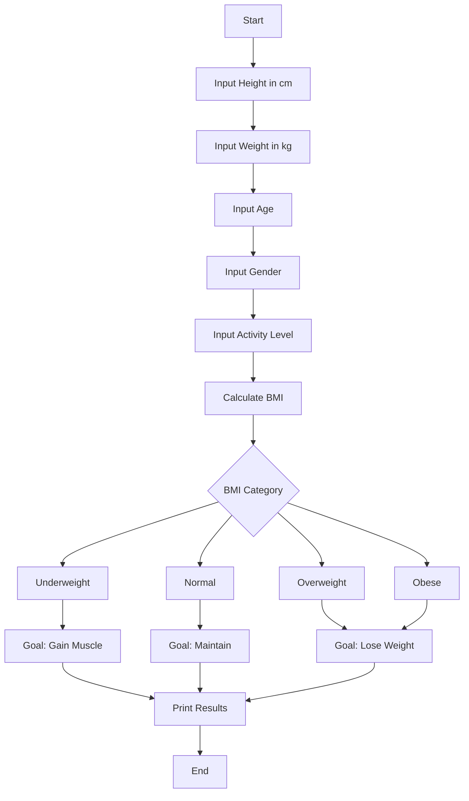

# 🧩 Healthy BMI Calculator  
A beginner-friendly Java console application that gathers user health data and provides BMI classification and a simple fitness recommendation.  
This is one of my first practical mini-projects built while learning Java fundamentals.

---

## 🚀 Features
- Accepts user input via `Scanner`
  - Height (cm)
  - Weight (kg)
  - Age
  - Gender (male/female)
  - Activity level (sedentary → highly active)
- Calculates:
  - **BMI (Body Mass Index)**
  - **Body type category** (Underweight / Normal / Overweight / Obese)
  - **Recommended fitness goal**
- Demonstrates use of:
  - `if-else` logic
  - `switch` (Java 14+ arrow syntax)
  - `Math` utilities
  - Ternary operator
  - Clean console output formatting

---

## 🛠 Tech Stack
- **Language:** Java  
- **Tools:** JDK, IntelliJ IDEA (or any IDE), Git / GitHub  
- **Concepts Practiced:**  
  - Input handling  
  - Branching logic  
  - Lightweight "business logic"  
  - Code structuring and naming practices  

---

## 🔍 Flowchart

